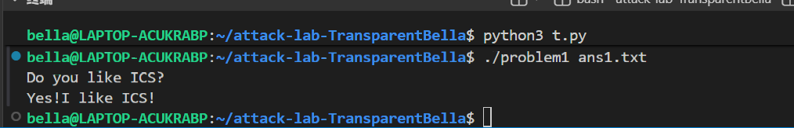
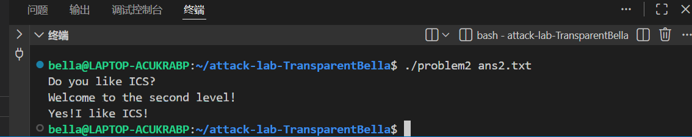
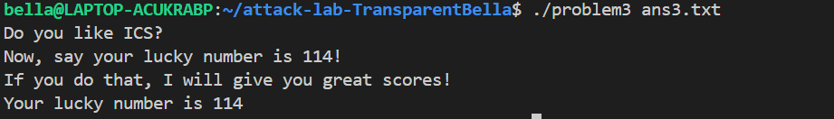

# 栈溢出攻击实验
2024201575 吴双琦
## 题目解决思路


### Problem 1: 
- **分析**：

main函数只调用了func，查看func发现其使用了 strcpy 函数，于是找到能够攻击的位置，即strcpy 的 src -0x8(%rbp)，需要通过修改在其中存储的内容，使其覆盖%rbp + 0x8 的返回地址。同时注意到 func1 没有被用到，查看后发现 func1 即打印出 Yes!I like ICS! 的函数，我们只需要把 func 的返回地址改为 func1 的地址 401216 即可。

所以我们的 padding 包括 8 字节被调用者保存寄存器保存的旧值和 8 字节本身字符串大小。而b"\x16\x12\x40\x00\x00\x00\x00\x00"就是我们的返回地址。

- **解决方案**：

```c
padding = b"A" * 16
return_addr = b"\x16\x12\x40\x00\x00\x00\x00\x00" 
payload = padding + return_addr
# Write the payload to a file
with open("ans1.txt", "wb") as f:
    f.write(payload)
print("Payload written to ans.txt")
```

- **结果**：



### Problem 2:
- **分析**：

分析 main 函数发现，函数要从打开的文件中读取 0x100 个 1 字节的内容到 0x120(%rbp)，然后调用 func 。 再调用 funcc ，funcc 中调用了 memcpy，将前面读取的内容复制 0x38 位（ 7 字节）到 funcc 此时的 -0x8(%rbp)中。所以我们就是要在 memcpy 这里进行攻击。 

显然 func2 中会实现打印 Do you like ICS?。但是 func2 首先检查了传入的参数 (%edi) 是否为 0x3f8。所以我们首先需要让 %edi 中存 0x3f8 再跳转到 func2. 

查看代码发现 pop_rdi 能把栈上内容 pop 到 %rdi 中，但是需要规划一下具体内容。我们只需要 pop 指令和 ret 指令，所以选择使 funcc 的返回地址被覆盖成 pop %rdi 指令所在地址。紧接着将 0x3f8 pop 进 %rdi，然后 ret，跳转到 %rsp 现在存的值中（安排为 func2 地址 0x401216）

所以整个栈在执行 funcc 返回时状态应该是

| func2 地址                 |   %rrbp + 0x18
| 0x3f8                        | %rbp + 0x10
| pop %rdi 地址 （原返回地址）| %rbp + 0x8
| AAAAAAAA（原寄存器保存旧值）| %rbp
| AAAAAAAA（memcpy 目的起始位置）| %rbp - 0x8
|              ...           |

- **解决方案**：

```c
padding = b"A" * 16
pop_addr = b"\xc7\x12\x40\x00\x00\x00\x00\x00"
test = b"\xf8\x03\x00\x00\x00\x00\x00\x00"
return_addr = b"\x16\x12\x40\x00\x00\x00\x00\x00" 
payload = padding + pop_addr + test + return_addr
# Write the payload to a file
with open("ans2.txt", "wb") as f:
    f.write(payload)
print("Payload written to ans.txt")
```
- **结果**：



### Problem 3: 
- **分析**：

本题的文件设置了不可执行
```c
ls -l problem3
-rw-r--r-- 1 bella bella 17440 Dec 24 19:37 problem3
```
所以先恢复文件为可执行的。

在开始之前，注意到本题提供了几个函数：
```c
func1//主要执行了puts，推断为最终打印神秘数字的函数
mov_rdi//把传入的第一个参数，通过栈中转，移动到 %rdi 中
mov_rax//把传入的第一个参数，通过栈中转，移动到 %rax 中
call_rax//调用以传入的第一个参数为地址的函数
jmp_x//以传入的第一个参数中存的内容为目标地址跳转
jmp_xs//以(一个存储在内存中的数saved_rsp + 0x10)为目标地址跳转
func
```

观察func:
```c
  401368:	48 89 05 a1 21 00 00 	mov    %rax,0x21a1(%rip)        # 403510 <saved_rsp>
```
说明jmp_xs的目标地址是func运行时的 -0x20(%rbp) 中存的内容。

接下来，func以-0x20(%rbp)为目标地址，func的第一个参数为源内容，进行 0x40 位的 memcpy. 这就是进行攻击的位置。func 返回地址在 0x8(%rbp)，相差 6 个字节，总共复制 8 个字节。

这时我们倒回去看 func1，发现它先检查了传入的第一个参数 %edi 是否等于 0x72。如果我们这里直接设置跳过这个检查，使得其直接打印接下来的字符串，那么就可以直接解出这道题。但是 func1 一直有使用 %rbp 中存储的值，所以我们必须使得 %rbp 中存储的地址可写。显然，如果我们直接给出一个数据段的地址，它就是可写的。

询问ai得到示例，safe_rbp = b"\x00\x40\x40\x00\x00\x00\x00\x00" 时可写。


- **解决方案**：
```c
buffer = b"A" * 32
safe_rbp = b"\x00\x40\x40\x00\x00\x00\x00\x00"
print = b"\x2b\x12\x40\x00\x00\x00\x00\x00"
payload = buffer + safe_rbp + print
with open("ans3.txt", "wb") as f:
    f.write(payload)
```

- **结果**：



### Problem 4: 
- **分析**：

这就是一个简单的 bomblab 题。前两次读取输入根本没有发生任何验证。第三次输入后，将输入作为第一个参数 a ，进入 func. 

func 主要执行的是 比较初始值为0的 x 和 0xfffffffe 的大小，执行循环直到 x >= 0xfffffffe。循环体是对 x++，对传入参数 a--。然后验证 a 是否等于 1. 如果等于，就跳转 func1 打印成功的字符串。否则失败。所以可以看出，需要执行 0xfffffffe 次循环，a减到 1 .所以 a 的初始值（输入值）为 0xffffffff.

在这个过程中，金丝雀值在每个函数开头设置，从 %fs:0x28 中读取内容并存放在被调用者保存寄存器旧值存储位置和局部变量存储位置之间。例如，这确保了输入的字符串不会太长以至于覆盖存储在 -0x8(%rbp) 的内容。当输入字符串太长，覆盖了-0x8(%rbp)栈上内容时，返回前的比较验证会发现其内容与开头设置的 %fs:0x28 （在受保护的段中）的内容不一致，从而触发__stack_chk_fail报警。


- **解决方案**：
```c
4294967295
```

- **结果**：


## 思考与总结

在实验中，通过自身探索和查阅ai及资料，我发现 64 位环境下，我们不能简单地通过栈传递参数，而必须寻找特定的 Gadget（如 pop rdi）来操纵寄存器。同时，在problem3中，我发现了栈对齐的重要性，忽略对齐会导致原本逻辑正确的 Payload 触发 Bus error 崩溃，我明白了如何在不可执行栈环境下通过跳转到既有函数代码段绕过防御。特别是将 %rbp 地址设为数据段的做法非常巧妙和有启发性。


## 参考资料

列出在准备报告过程中参考的所有文献、网站或其他资源，确保引用格式正确。
